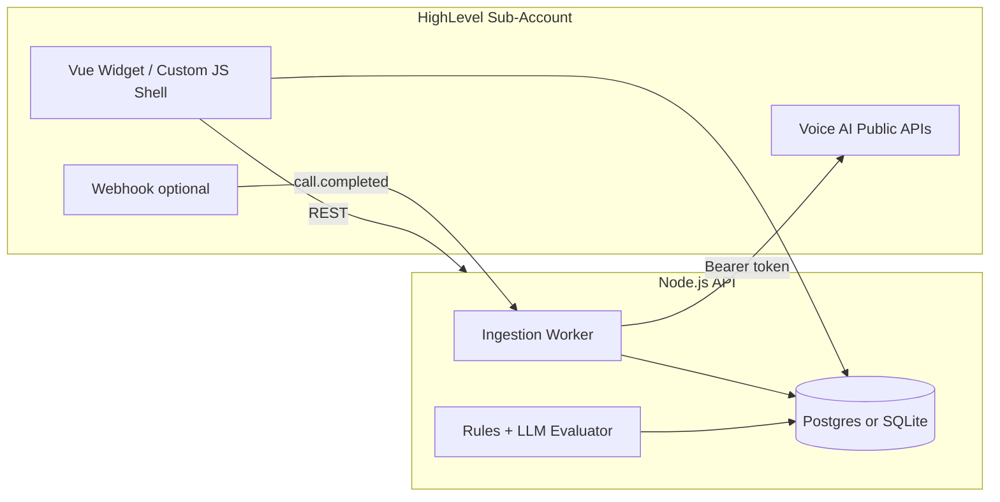

# Voice AI Observability Copilot — Build Plan

**Assignment:** [Hiring] FSB Assignment Q226  
**Target:** 2-week solo build closing the loop **transcripts → KPI gaps → dashboard → recommendations**, with a crisp **2–5 minute demo**.

---

## 1. Goal and success criteria

| Must ship | Nice to have |
|-----------|----------------|
| Runs inside HighLevel (Custom JS or marketplace iframe) | Full marketplace listing approval |
| Ingests real Voice AI call logs/transcripts (at least polling) | Live webhooks for every new call |
| Per-agent success criteria (goals/KPIs) | Auto-apply prompt changes |
| Dashboard: agents, issues, metrics | Multi-location rollup |
| AI recommendations + “Use Actions” highlights | Historical trend charts (30+ days) |

**Demo story (one sentence):** Pick an agent → see calls scored against KPIs → drill into a failed call → see transcript moments flagged → get 3 concrete script/prompt fixes.

---

## 2. Architecture



### Stack (per assignment)

| Layer | Choice |
|-------|--------|
| Frontend | Vue 3 + Vite (embeddable SPA) |
| Backend | Node.js + Express or Fastify |
| Database | SQLite locally; Postgres if deployed (Railway/Render) |
| AI | One LLM provider (OpenAI/Anthropic) with structured JSON output |
| Auth | GHL Private Integration Token or OAuth sub-account token — **server-side only** |

---

## 3. HighLevel integration

### Option A — Marketplace app + iframe (recommended)

| Pros | Cons |
|------|------|
| Clean separation; full Vue app | Slightly more setup |
| Backend holds secrets safely | Needs public HTTPS URL |

**Flow:**

1. Create app in [HighLevel Marketplace](https://marketplace.gohighlevel.com) → sandbox sub-account.
2. Register **Custom Menu Link** or **iframe** pointing to the Vue app URL.
3. Pass `locationId` via query or read with `AppUtils.Utilities.getCurrentLocation()` in a thin Custom JS loader.
4. Backend uses **Sub-Account Private Integration Token** scoped to Voice AI.

### Option B — Custom JS only

| Pros | Cons |
|------|------|
| Lives fully inside GHL | 5KB storage limits; no secrets in browser |
| Good for small UI shell | Heavy logic must call backend |

**Practical hybrid:** Custom JS bootstraps iframe or fetches config; **all transcript analysis on the Node backend**.

### Custom JS utilities (reference)

- Storage: `AppUtils.Storage.setData` / `getData` (keys auto-prefixed `custom_`)
- Events: `routeLoaded`, `routeChangeEvent`
- Context: `getCurrentUser()`, `getCurrentLocation()`, `getCompany()`
- Docs: [CustomJS | HighLevel API](https://marketplace.gohighlevel.com/docs/marketplace-modules/custom-js)

---

## 4. HighLevel APIs

| Capability | Use in copilot |
|------------|----------------|
| List agents | Dashboard agent picker |
| Get agent config | Seed observability parameters |
| Call logs + transcripts | Monitor loop input |
| Webhooks | Real-time ingestion (or poll every 5 min for MVP) |
| Actions APIs | Map “Use Actions” to real GHL action names when possible |

**Docs:** [Voice AI API](https://marketplace.gohighlevel.com/docs/ghl/voice-ai/voice-ai-api/index.html)

### Ingestion MVP

1. On connect: backfill last **7–14 days** of calls per agent (paginated).
2. Cron or webhook: process new calls only.
3. Store raw transcript + metadata (`callId`, `agentId`, `contactId`, `duration`, `outcome`, `timestamp`).

**Fallback:** Ship with **3–5 realistic JSON fixtures**; README must label **mock vs live**.

---

## 5. Data model

### Tables

```text
agents
  id, ghl_agent_id, name, location_id
  success_criteria (JSON)
  script_summary (text)

calls
  id, ghl_call_id, agent_id, contact_id
  started_at, duration_sec, disposition
  transcript (text/json)
  status: pending | analyzed | failed

call_evaluations
  call_id, overall_score (0-100)
  kpi_results (JSON[])
  deviations (JSON[])
  use_actions (JSON[])

recommendations
  agent_id, generated_at
  items (JSON[])
```

### Success criteria schema (example)

```json
{
  "kpis": [
    { "id": "booking", "label": "Appointment booked", "type": "boolean", "weight": 30 },
    { "id": "qualify", "label": "Budget & timeline captured", "type": "boolean", "weight": 25 },
    { "id": "objection", "label": "Price objection handled", "type": "boolean", "weight": 20 },
    { "id": "compliance", "label": "Recording disclaimer stated", "type": "boolean", "weight": 25 }
  ],
  "script_must_mention": ["company name", "warranty"],
  "failure_signals": ["caller hung up angry", "agent looped 3+ times"]
}
```

### KPI result shape

```json
{
  "kpi": "booking",
  "pass": false,
  "evidence": "Caller said they'd call back; no appointment offered.",
  "severity": "high"
}
```

### Use Action shape

```json
{
  "start_sec": 120,
  "end_sec": 185,
  "label": "Price objection mishandled",
  "reason": "Agent repeated pricing without addressing concern.",
  "priority": "high"
}
```

---

## 6. Core product flows

### Flow A — Setup (first run)

1. User opens copilot in GHL (token configured in env).
2. **Sync agents** from Voice AI API.
3. Per agent: auto-suggest KPIs from description/prompt (LLM once) → user edits → **Save criteria**.
4. Trigger **initial transcript sync**.

### Flow B — Monitor (observability)

For each new or updated call:

1. **Normalize transcript** (speaker turns if available).
2. **Rule pass** (deterministic): duration, disposition, keyword checks for `script_must_mention`.
3. **LLM pass** (structured): score KPIs, list deviations, extract **Use Actions** with timestamps or turn indices.
4. Persist `call_evaluations`; mark call `analyzed`.

**Use Actions:** Segments requiring human **review**, **script retraining**, or **agent config** fixes.

### Flow C — Analyze (dashboard)

| Screen | Content |
|--------|---------|
| **Overview** | All agents: pass rate, open issues, calls last 7d, top failure category |
| **Agent detail** | KPI breakdown, trend sparkline, worst calls list |
| **Call drill-down** | Transcript with highlights; KPI checklist; Use Action cards |
| **Recommendations** | Prioritized fixes: prompt diff, script bullet, config toggle |

**Recommendation types:** `prompt_edit` | `script_addition` | `agent_behavior` | `human_workflow`

---

## 7. AI evaluation pipeline

Three-stage pipeline (reduces cost and hallucination):

```text
Transcript + success_criteria
        │
        ▼
┌───────────────────┐
│ Stage 1: Extract  │  facts only: intents, outcomes, quotes
└─────────┬─────────┘
          ▼
┌───────────────────┐
│ Stage 2: Score    │  KPI pass/fail + evidence + use_actions
└─────────┬─────────┘
          ▼
┌───────────────────┐
│ Stage 3: Recommend│  agent-level rollup (last N failed calls)
└───────────────────┘
```

### Prompt rules

- Require **evidence quotes** from transcript for every failure.
- Output **strict JSON**; validate with Zod before DB write.
- Empty transcript → `status: failed`, no fabricated KPIs.

### Agent-level recommendations

Feed last **10 failed/low-score calls** + aggregated deviation counts → one LLM call per agent (on-demand **“Refresh insights”** for demo).

---

## 8. Backend API

| Method | Path | Purpose |
|--------|------|---------|
| POST | `/api/connect` | Validate GHL token, store location |
| GET | `/api/agents` | List agents + scores |
| PUT | `/api/agents/:id/criteria` | Save KPI config |
| POST | `/api/sync` | Pull transcripts |
| GET | `/api/agents/:id/calls` | Paginated calls + scores |
| GET | `/api/calls/:id` | Transcript + evaluation + use_actions |
| GET | `/api/agents/:id/recommendations` | Latest insight bundle |
| POST | `/api/webhooks/ghl` | Optional real-time ingest |

---

## 9. Frontend (Vue) — page map

```text
/                          → Overview dashboard
/agents/:id                → Agent performance
/agents/:id/calls/:callId  → Call detail + highlights
/agents/:id/settings       → KPI editor
/agents/:id/insights       → Recommendations panel
```

### UX priorities

- GHL-native feel: cards, status colors (red/amber/green), minimal chrome.
- Empty states with **“Sync now”** CTA.
- Loading skeletons during analysis.
- **“Copy prompt suggestion”** on each recommendation.

### Embed

Build as SPA; configure `base` URL for iframe; optional `postMessage` for height resize.

---

## 10. Mock vs real

| Component | MVP (real) | Acceptable mock |
|-----------|------------|-----------------|
| Agent list | API | — |
| Transcript fetch | API or webhook | Fixture JSON if token delayed |
| KPI scoring | LLM on real transcripts | Pre-baked evaluation for 1 demo call |
| Dashboard metrics | From DB | Static chart if no history |
| Recommendations | LLM rollup | Cached set for demo agent |
| Webhooks | Optional | Poll every 5 min (“near real-time”) |

Document this table in the submission README.

---

## 11. Implementation timeline (10 working days)

| Day | Focus |
|-----|--------|
| 1 | GHL sandbox, marketplace app shell, Node+Vue repo, deploy hello iframe |
| 2 | Token auth, list agents, call log ingestion + DB schema |
| 3 | KPI settings UI + save criteria per agent |
| 4 | Transcript normalization + rule-based checks |
| 5 | LLM evaluation pipeline + call detail UI with highlights |
| 6 | Overview + agent dashboard metrics |
| 7 | Recommendations engine + insights page |
| 8 | Use Actions UX, polish, error states |
| 9 | README, install steps, seed demo data, manual QA |
| 10 | Loom demo rehearsal, code cleanup, manual review |

---

## 12. Demo script (2–5 minutes)

| Time | Action |
|------|--------|
| 0:00–0:30 | Open GHL → custom menu “Observability Copilot” |
| 0:30–1:00 | Overview: 2 agents, one flagged low pass rate |
| 1:00–2:00 | Agent detail → worst call → KPI failures with transcript quotes |
| 2:00–3:00 | **Use Actions** (timestamped segments) |
| 3:00–4:30 | Insights → 3 recommendations; “Copy suggestion” |
| 4:30–5:00 | Architecture note; what is live vs mocked |

---

## 13. Repository layout

```text
voice-ai-copilot/
├── apps/
│   ├── api/          # Node Express/Fastify
│   └── web/          # Vue 3 + Vite
├── packages/
│   └── shared/       # Zod schemas, types
├── fixtures/         # sample transcripts
├── docs/
│   ├── ARCHITECTURE.md
│   └── GHL_SETUP.md
├── README.md
└── docker-compose.yml  # optional Postgres
```

---

## 14. Deliverables checklist (assignment mapping)

| Deliverable | Artifact |
|-------------|----------|
| Code & implementation | GitHub repo: widget/app + Node backend + Vue frontend |
| Install & run | `docs/GHL_SETUP.md` + README |
| Demo (2–5 min) | Loom: ingest → dashboard → recommendations |
| README | Architecture + **Team of One** + functional vs mocked |
| Evaluation: Product/UI | Intuitive dashboard inside GHL |
| Evaluation: Completeness | Logs → issues → recommendations |
| Evaluation: Technical | Clear observability + recommendation logic |
| Evaluation: Code quality | Manual review; no sloppy/generated filler |

---

## 15. README outline (submission)

1. Problem and solution (2 paragraphs)
2. Architecture diagram + data flow
3. **Team of One** — Product / Design / Engineering / QA responsibilities
4. Install: env vars, GHL token scopes, iframe URL, `npm run dev`
5. **Functional vs mocked** table
6. API keys and LLM cost notes
7. Demo link (Loom)
8. Future work (webhooks, auto-prompt updates, alerts)

---

## 16. Evaluation alignment

- [ ] Dashboard answers “which agent is broken and why?” in under 10 seconds
- [ ] Full loop: raw log → scored call → agent recommendation without manual transcript reading
- [ ] Documented ingestion + evaluation pipeline; JSON schema validation
- [ ] Visible inside GHL in demo (not localhost-only)
- [ ] Small modules: `ingest`, `evaluate`, `recommend`, `routes`

---

## 17. Risks and mitigations

| Risk | Mitigation |
|------|------------|
| Voice AI API access delayed | Fixtures + `USE_FIXTURES=true` |
| Transcripts lack timestamps | Turn index + approximate labels |
| LLM cost/latency | Analyze on sync; cache results |
| iframe auth | Server-side token only |
| Thin call history | Seed 5 fixture calls for one agent |

---

## 18. Minimum viable scope (if time runs out)

**Keep:** 1 agent, real API ingest, dashboard + 1 call detail + 3 recommendations.

**Cut:** webhooks, multi-location, trends, full marketplace publication (iframe + docs is sufficient).

---

## References

- Assignment: `[Hiring] FSB Assignment Q226.md`
- **Verified API curls & project mapping:** [docs/GHL_API.md](docs/GHL_API.md)
- **LLM pipeline:** [docs/LLM_PIPELINE.md](docs/LLM_PIPELINE.md)
- [Voice AI API | HighLevel](https://marketplace.gohighlevel.com/docs/ghl/voice-ai/voice-ai-api/index.html)
- [CustomJS | HighLevel](https://marketplace.gohighlevel.com/docs/marketplace-modules/custom-js)
- [HighLevel API SDK](https://github.com/gohighlevel/highlevel-api-sdk)
