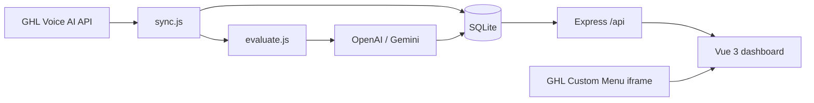

# Architecture

Voice AI Observability Copilot ingests HighLevel Voice AI call logs, evaluates each session with an LLM, and surfaces dashboards and recommendations inside a GHL iframe.

## Data flow

## Components

| Layer | Path | Responsibility |
|-------|------|----------------|
| GHL client | `apps/api/src/ghl/` | Per-agent credentials; list agents, fetch call logs + transcripts |
| Sync | `apps/api/src/services/sync.js` | Paginated ingest; pending calls always evaluated |
| Scheduler | `apps/api/src/services/sync-scheduler.js` | Per-agent auto-fetch |
| Evaluate | `apps/api/src/services/evaluate.js` | Per-call LLM score, KPIs, deviations, Use Actions, suggestions |
| Recommend | `apps/api/src/services/recommendations.js` | Agent-level LLM recommendations (cached) |
| Monitored agents | `apps/api/src/services/monitored-agents.js` | Per-agent GHL token, location, evaluation prompt |
| LLM | `apps/api/src/llm/` | Provider abstraction, JSON schema normalization |
| Web | `apps/web/` | Overview, agent/call detail, insights, settings |
| Embed | `apps/web/src/ghl/embed.js` | Parse `location_id` from GHL iframe URL |

## Evaluation pipeline

1. **Sync** fetches all paginated call-log pages per monitored agent (`listAllCallLogs`).
2. **Normalize** GHL fields (`normalize-call-log.js`) — transcript, `extractedData`, etc.
3. **Fingerprint** (`eval-fingerprint.js`) — transcript, summary, prompts, extracted data; skip LLM if unchanged.
4. **Evaluate** — always runs for `pending` calls or missing evaluation; per-call errors don't stop the batch.
5. **Recommend** — agent-level LLM insights (cached).

## Auto-sync scheduler

- `sync-scheduler.js` ticks every **60 seconds**.
- Each `monitored_agents` row has `sync_interval_minutes` (0 = manual) and `last_auto_sync_at`.
- Due agents sync **sequentially** via `triggerSync('schedule', { ghlAgentId })`.

## Database (SQLite)

- `monitored_agents` — per-agent GHL JWT, location, `evaluation_prompt`, `sync_interval_minutes`, `last_auto_sync_at`
- `agents`, `calls` — synced from GHL (`extracted_data`, transcript, `status`: pending / analyzed)
- `call_evaluations` — scores, KPIs, deviations, use_actions, suggestions, `eval_fingerprint`
- `recommendations` — cached agent-level insight items
- `llm_settings`, `ghl_settings` — optional UI-managed defaults (runtime uses per-agent creds in Agents settings)
- `sync_runs` — sync job history

`agent-records.js` backfills `agents` rows when agents are added to the monitor list (dashboard shows monitored agents even before first sync).

## Web routes (Vue)

| Route | Screen |
|-------|--------|
| `/` | Overview + sync |
| `/settings` | LLM provider + API key |
| `/settings/agents` | Monitored agents, GHL JWT, auto-fetch schedule, evaluation criteria |
| `/settings/ghl` | Optional global GHL defaults |
| `/agents/:id` | Call list |
| `/agents/:id/calls/:callId` | Call detail |
| `/agents/:id/insights` | Agent recommendations |

## Deployment modes

| Mode | Command | Use case |
|------|---------|----------|
| Dev | `npm run dev` | API `:3001`, Vite `:5173` with proxy |
| Production | `npm run start:prod` | Single port serves UI + API for GHL iframe |

## Security notes

- GHL tokens stored server-side in SQLite (per monitored agent).
- LLM API keys stored server-side via AI Settings UI.
- `frame-ancestors` CSP allows embedding only in GHL domains.
- No secrets required in `.env` for normal operation (UI-first config).

## Related docs

- [GHL_SETUP.md](GHL_SETUP.md) — marketplace iframe install
- [GHL_API.md](GHL_API.md) — verified API endpoints
- [LLM_PIPELINE.md](LLM_PIPELINE.md) — prompts and schemas
